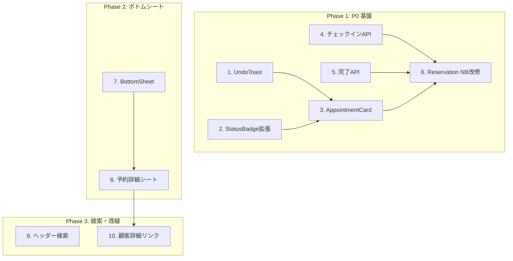

# モバイル UI/UX ギャップ分析レポート
> Customer Notebook - As-Is / To-Be Gap Review

**作成日**: 2025-12-17  
**バージョン**: 1.0

---

## 1. 対象範囲

### 参照した設計書
- [MOBILE_UX_PLAN.md](./MOBILE_UX_PLAN.md) - モバイルUI/UX設計書（To-Be）
- [USECASES_MOBILE.md](./USECASES_MOBILE.md) - モバイルユースケース（19件）

### 参照した主要実装ファイル/画面

| ファイル | 役割 |
|:---|:---|
| `src/app/page.tsx` | ホーム画面（ダッシュボード） |
| `src/components/GlobalNavigation.tsx` | グローバルナビ（ヘッダー+モバイルドロワー） |
| `src/app/customer-notebook/` | Customer Notebook（顧客リスト+プレビュー） |
| `src/app/customers/[id]/CustomerDetailClient.tsx` | 顧客詳細（タイムライン+プロフィール） |
| `src/app/reservation-notebook/` | Reservation Notebook（予約一覧+CRUD） |
| `src/components/ui/` | 共通コンポーネント（Button, Card, Dialog, Toast等） |
| `src/components/mobile/MobileVoiceInput.tsx` | モバイル音声入力 |

---

## 2. 設計書の要点抽出（To-Be要約）

### 主要画面（上位5）

| 画面ID | 画面名 | 目的 |
|:---|:---|:---|
| SCR-01 | **Home（今日の予約）** | 当日予約一覧、ステータス管理、チェックイン/完了 |
| SCR-02 | **予約詳細シート** | ボトムシートで予約操作（時間変更、キャンセル等） |
| SCR-03 | **顧客詳細** | 顧客情報+タイムライン、メモ追加 |
| SCR-04 | **検索** | グローバル検索（名前/電話番号）、最近の顧客 |
| SCR-05 | **予約作成シート** | ボトムシートで新規予約登録 |

### 主要導線（上位5）

1. **起動 → 今日の予約 → チェックイン/完了**（M-UC-01, 03, 13）
2. **検索 → 顧客詳細 → 予約作成**（M-UC-06, 09）
3. **予約カード → ボトムシート → 時間変更**（M-UC-04, 10）
4. **予約カード → キャンセル（確認付き）**（M-UC-05）
5. **顧客詳細 → メモ追加（音声）**（M-UC-18）

### "1画面で完結させる操作" 上位5

| 順位 | 操作 | 根拠UC |
|:---:|:---|:---|
| 1 | チェックイン（カード上スワイプ/タップ） | M-UC-03 |
| 2 | 施術完了（カード上タップ） | M-UC-13 |
| 3 | キャンセル（ボトムシート内で完結） | M-UC-05 |
| 4 | 予約時間変更（ボトムシート内で完結） | M-UC-04 |
| 5 | 担当者変更（ボトムシート内で完結） | M-UC-11 |

---

## 3. 現状実装の要点抽出（As-Is要約）

### 現在存在する画面一覧

| 画面 | URL | 説明 |
|:---|:---|:---|
| Dashboard | `/` | 2つのNotebookへのエントリーポイント |
| Customer Notebook | `/customer-notebook` | 顧客リスト + 右サイドにプレビュー表示 |
| Customer Detail | `/customers/[id]` | 2カラム/タブ（モバイル）でプロフィール+タイムライン |
| Customer New | `/customers/new` | 顧客新規登録フォーム |
| Reservation Notebook | `/reservation-notebook` | 今日の予約リスト + 予約作成/編集フォーム |

### 現在の主要導線

```
Dashboard → Customer Notebook → 顧客選択（リストクリック）→ プレビュー表示
                                    └→ 矢印アイコン → 顧客詳細ページ
                                    
Dashboard → Reservation Notebook → 今日の予約リスト → 編集/キャンセル
```

### 既に良い点（残すべき点）

| 項目 | 説明 | 関連UC |
|:---|:---|:---|
| ✅ **Groq音声入力統合済** | MediaRecorder + whisper-large-v3でモバイル音声入力対応 | M-UC-18 |
| ✅ **AI整形機能** | 音声テキストの自動整形、重要事項抽出 | M-UC-18 |
| ✅ **モバイルタブUI** | 顧客詳細でプロフィール/タイムラインをタブ切替 | - |
| ✅ **ステータスバッジ** | Reservation Notebookで予約ステータス表示 | M-UC-01 |
| ✅ **確認ダイアログ** | `ConfirmDialog.tsx` が既に存在 | M-UC-05, 14 |
| ✅ **Toastコンポーネント** | `sonner` ベースで実装済み | M-UC-16 |
| ✅ **GlobalNavigation** | ヘッダー + モバイルドロワー対応 | - |

---

## 4. ギャップ表（最重要）

### 4.1 画面構成のギャップ

| 設計項目 | 根拠UC | 現状 | 差分の説明 | 修正候補 | 優先度 | 難易度 |
|:---|:---|:---|:---|:---|:---:|:---:|
| **Home = 今日の予約** | M-UC-01〜05, 13 | ❌ NG | 現在はダッシュボード（2つのNotebookカード） | `/` を「今日の予約」に変更 or 専用ページ作成 | **P0** | M |
| **予約詳細ボトムシート** | M-UC-04, 10, 11 | ❌ NG | 存在しない（別ページ・インライン編集） | `BottomSheet` コンポーネント新規作成 | **P0** | M |
| **グローバル検索バー** | M-UC-06, 07 | ⚠️ Partial | 各画面に個別検索あり、ヘッダーには未実装 | ヘッダーに常時表示の検索アイコン追加 | **P1** | S |
| **最近の顧客リスト** | M-UC-08 | ❌ NG | 存在しない | ローカルストレージで履歴保持、検索画面に表示 | **P2** | S |

### 4.2 操作・インタラクションのギャップ

| 設計項目 | 根拠UC | 現状 | 差分の説明 | 修正候補 | 優先度 | 難易度 |
|:---|:---|:---|:---|:---|:---:|:---:|
| **チェックイン（1タップ/スワイプ）** | M-UC-03 | ❌ NG | 機能なし（status更新UIなし） | 予約カードにスワイプ or ボタン追加 | **P0** | M |
| **施術完了（1タップ）** | M-UC-13 | ❌ NG | 機能なし | 予約カードに完了ボタン追加 | **P0** | S |
| **Undoトースト** | M-UC-03, 13, 16 | ❌ NG | 現在のToastにUndo機能なし | `UndoToast` 専用コンポーネント作成 | **P0** | M |
| **予約時間変更（ボトムシート内）** | M-UC-04 | ⚠️ Partial | Reservation Notebookにフォームあり、モバイル最適化不足 | TimePicker + ボトムシート統合 | **P1** | M |
| **キャンセル確認ダイアログ** | M-UC-05 | ✅ OK | `ConfirmDialog.tsx` 実装済み | - | - | - |
| **二重予約警告** | M-UC-15 | ⚠️ Partial | 重複チェックロジック未確認 | 予約作成/変更時に警告UI追加 | **P2** | M |

### 4.3 コンポーネントのギャップ

| 設計項目 | 根拠UC | 現状 | 差分の説明 | 修正候補 | 優先度 | 難易度 |
|:---|:---|:---|:---|:---|:---:|:---:|
| **AppointmentCard** | M-UC-01〜05 | ⚠️ Partial | Reservation Notebookにカードあるが、ステータス操作不可 | アクション可能なカードに拡張 | **P0** | M |
| **BottomSheet** | M-UC-04, 09〜12 | ❌ NG | 存在しない | Radix/自作でボトムシート実装 | **P0** | M |
| **TimePicker（15分刻み）** | M-UC-04, 09 | ❌ NG | 存在しない（input[type=time]使用） | 専用時間ピッカー作成 | **P1** | M |
| **SearchBar** | M-UC-06, 07 | ⚠️ Partial | 画面内inputはあるが、グローバルアクセス不可 | ヘッダー統合 | **P1** | S |
| **CustomerSummary** | M-UC-02 | ⚠️ Partial | 顧客詳細のプロフィールカードがある | コンパクト版を別途作成 | **P2** | S |
| **UndoToast** | M-UC-16 | ❌ NG | 存在しない | sonnerベースでUndo付きトースト | **P0** | S |

### 4.4 導線・ナビゲーションのギャップ

| 設計項目 | 根拠UC | 現状 | 差分の説明 | 修正候補 | 優先度 | 難易度 |
|:---|:---|:---|:---|:---|:---:|:---:|
| **起動 → 今日の予約（2タップ以内）** | M-UC-01 | ❌ NG | 起動→Dashboard→Reservation NB→今日の予約（3タップ） | Home = 今日の予約に変更 | **P0** | S |
| **予約カード→顧客詳細へのクイックナビ** | M-UC-02 | ❌ NG | 予約カードから顧客詳細への導線なし | カードに顧客名タップで詳細リンク | **P1** | S |
| **顧客詳細→予約作成** | M-UC-09 | ⚠️ Partial | 導線未確認 | 顧客詳細に「予約追加」ボタン | **P1** | S |

---

## 5. 改修ロードマップ

### P0: まず絶対直す（モバイル当日運用の最低限）

| # | タスク | 完了条件（Done） | 工数 |
|:---:|:---|:---|:---:|
| P0-1 | `AppointmentCard` の拡張（アクションボタン追加） | カード上でチェックイン/完了ボタンが機能する | 0.5日 |
| P0-2 | `UndoToast` コンポーネント作成 | ステータス更新後に3秒間Undo可能 | 0.5日 |
| P0-3 | チェックイン機能実装（API + UI） | 1タップでステータス `checked_in` に更新 | 0.5日 |
| P0-4 | 完了記録機能実装（API + UI） | 1タップでステータス `completed` に更新 | 0.25日 |
| P0-5 | **Home画面を「今日の予約」に変更** または専用ページ作成 | 起動→今日の予約が2タップ以内 | 0.75日 |
| P0-6 | `BottomSheet` コンポーネント作成 | 予約詳細がボトムシートで表示される | 0.75日 |

**P0合計: 約3.25日**

### P1: 改善効果が大きい

| # | タスク | 完了条件（Done） | 工数 |
|:---:|:---|:---|:---:|
| P1-1 | グローバル検索バー（ヘッダー統合） | ヘッダーの検索アイコンから顧客検索可能 | 0.5日 |
| P1-2 | `TimePicker` コンポーネント作成（15分刻み） | 時間選択UIが存在する | 0.5日 |
| P1-3 | 予約編集ボトムシート統合 | ボトムシート内で時間・担当者変更可能 | 0.75日 |
| P1-4 | キャンセル機能のボトムシート統合 | ボトムシート内でキャンセル確認→実行 | 0.5日 |
| P1-5 | 予約カード→顧客詳細リンク | カードの顧客名タップで詳細に遷移 | 0.25日 |
| P1-6 | 顧客詳細→予約追加ボタン | 顧客詳細から予約作成への導線が存在 | 0.25日 |

**P1合計: 約2.75日**

### P2: 後回しでOK

| # | タスク | 完了条件（Done） | 工数 |
|:---:|:---|:---|:---:|
| P2-1 | 最近の顧客リスト（ローカルストレージ） | 直近5件の顧客が検索画面に表示される | 0.5日 |
| P2-2 | 二重予約警告UI | 重複予約時に警告ダイアログが表示される | 0.5日 |
| P2-3 | `CustomerSummary` コンパクト版 | 次の顧客情報がコンパクトに表示される | 0.25日 |
| P2-4 | No-show記録機能 | 確認付きでNo-show記録可能 | 0.25日 |
| P2-5 | 予約作成ボトムシート | 顧客詳細からボトムシートで予約作成 | 0.5日 |

**P2合計: 約2日**

---

## 6. 最小改修案と大胆改修案

### 6.1 最小改修案（既存構造を保って改善）

**アプローチ**: 現在のReservation Notebookを「今日の予約」ベースに改修し、既存のUIコンポーネントを活用。

#### 変更点
1. `/reservation-notebook` の今日の予約リストにアクションボタン追加
2. 既存の `sonner` トーストに `action` プロパティでUndo追加
3. GlobalNavigationに検索アイコン追加→モーダルで検索

#### メリット
- 既存コードの大幅変更不要
- 実装期間短縮（P0のみで約2〜3日）
- 学習コスト低（現在の構造を維持）

#### デメリット
- Home画面の位置づけが曖昧なまま
- ボトムシートなしの場合、モバイルでの操作が画面遷移を伴う
- 設計書のTo-Be像からの乖離が残る

---

### 6.2 大胆改修案（画面構成・ナビを変更）

**アプローチ**: Home画面を「今日の予約」に置き換え、ボトムシートUIを全面導入。

#### 変更点
1. `/` を「今日の予約」ページに変更（現Dashboardは `/dashboard` か削除）
2. 新規 `BottomSheet` コンポーネントで予約詳細・編集・顧客サマリを表示
3. GlobalNavigationを「検索 | Home | 顧客」の3アイコンに再構成
4. 顧客詳細からのクイック予約作成をボトムシートで実現

#### メリット
- 設計書のTo-Be像に完全一致
- モバイルファーストで画面遷移を最小化
- 将来的なPWA化・オフライン対応への土台

#### デメリット
- 実装期間が長い（P0+P1で約6日）
- ナビゲーション構造の変更によるユーザー再学習
- 既存Dashboardを利用しているユーザーへの影響

---

### 推奨

**段階的アプローチ**:
1. まず**最小改修案**でP0を完了（当日運用可能な状態）
2. ユーザーフィードバックを得ながら**大胆改修案**のP1を徐々に適用
3. Reservation NotebookのUIが成熟したらHomeに統合

---

## 7. 次に着手すべきチケット（10個）

### Phase 1: P0 基盤（依存関係順）

| # | チケット | 工数 | 依存 | 説明 |
|:---:|:---|:---:|:---|:---|
| 1 | **`UndoToast` コンポーネント作成** | 0.5日 | - | sonnerのundo付きトーストを拡張 |
| 2 | **`StatusBadge` 拡張** | 0.25日 | - | checked_in, completed, no_show対応 |
| 3 | **`AppointmentCard` アクション追加** | 0.5日 | 1, 2 | チェックイン/完了ボタン、スワイプ（オプション） |
| 4 | **チェックインAPI/Server Action** | 0.25日 | - | `updateAppointmentStatus(id, 'checked_in')` |
| 5 | **完了API/Server Action** | 0.25日 | 4 | `updateAppointmentStatus(id, 'completed')` |
| 6 | **Reservation Notebook UI改修** | 0.5日 | 3, 4, 5 | カードにアクションボタン統合、Undo統合 |

### Phase 2: P0 ボトムシート

| # | チケット | 工数 | 依存 | 説明 |
|:---:|:---|:---:|:---|:---|
| 7 | **`BottomSheet` コンポーネント作成** | 0.75日 | - | Radixベース or 自作、ドラッグハンドル付き |
| 8 | **予約詳細ボトムシート実装** | 0.5日 | 7 | カードタップ→ボトムシートで詳細表示 |

### Phase 3: P1 検索・導線

| # | チケット | 工数 | 依存 | 説明 |
|:---:|:---|:---:|:---|:---|
| 9 | **ヘッダー検索アイコン追加** | 0.5日 | - | GlobalNavに検索アイコン、モーダル検索 |
| 10 | **予約カード→顧客詳細リンク** | 0.25日 | 8 | ボトムシート内に「顧客詳細を見る」リンク |

---

## 付録: 依存関係図



---

*ギャップ分析レポート バージョン: 1.0 (2025-12-17)*
