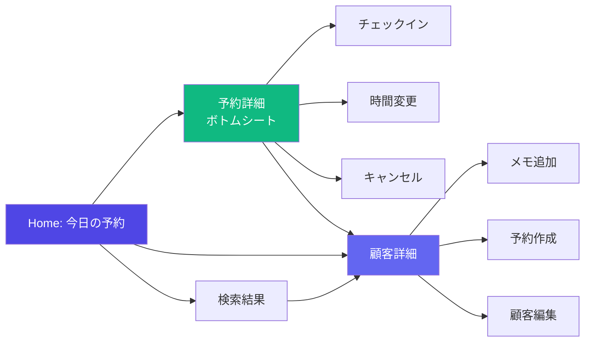

# モバイル UI/UX 設計書
> Customer Notebook - Mobile UX Plan

**作成日**: 2025-12-17  
**バージョン**: 1.0  
**根拠ドキュメント**: [USECASES_MOBILE.md](./USECASES_MOBILE.md)

---

## 1. 目的と対象範囲

### 目的
- **19件のモバイルユースケース**を実現するためのUI/UX設計を定義する
- モバイルでの「当日運用」「顧客検索」「予約変更/キャンセル」が**迷わず短手順**で完結するUIを設計する
- 実装タスクの優先度と依存関係を明確にし、段階的に開発できるようにする

### 対象範囲
| 対象 | 説明 |
|:---|:---|
| ✅ スコープ内 | Customer Notebook のモバイルUI最適化、フロントエンド実装 |
| ✅ スコープ内 | 既存コンポーネントのモバイル対応改修 |
| ❌ スコープ外 | DBスキーマ変更、バックエンドAPI変更 |
| ❌ スコープ外 | Reservation Notebook（別途設計書を作成） |

---

## 2. モバイル利用前提

### 物理的制約
| 制約 | 設計への反映 |
|:---|:---|
| **片手操作（右手親指）** | 重要なアクションは画面下半分に配置、ボトムシート活用 |
| **短時間操作（30秒〜2分）** | 1画面で完結する操作を最大化、遷移を最小化 |
| **隙間時間利用** | 施術合間・会計待ち・移動中を想定、読み込み時間を最小化 |
| **立ったまま操作** | 大きなタップ領域（最低44px）、スクロール最小化 |

### 技術的制約
| 制約 | 設計への反映 |
|:---|:---|
| **回線不安定** | オプティミスティックUI、失敗時のリトライUI |
| **低電力モード** | アニメーション控えめ、バックグラウンド処理最小化 |
| **HTTPS必須（音声入力）** | 非HTTPSでの明確なエラーメッセージ（M-UC-18） |

### 誤操作対策
| 対策 | 適用操作 |
|:---|:---|
| **確認ダイアログ必須** | キャンセル（M-UC-05）、No-show（M-UC-14） |
| **Undoトースト（3〜5秒）** | チェックイン（M-UC-03）、完了（M-UC-13）、ステータス変更 |
| **スワイプ＋確認** | 削除系操作はスワイプのみでは実行不可 |

---

## 3. 主要ユーザーと利用シーン

### ユーザーペルソナ
| ユーザー | 主な利用シーン | 優先ユースケース |
|:---|:---|:---|
| **院長** | 出勤前の予約確認、シフト調整 | M-UC-01, M-UC-04, M-UC-11 |
| **受付** | 電話対応中の検索・変更、チェックイン | M-UC-03, M-UC-06, M-UC-07, M-UC-09 |
| **スタッフ** | 施術前の顧客確認、施術後の記録 | M-UC-02, M-UC-13, M-UC-18 |

### 利用時間帯と行動パターン
```
08:30  院長が出勤前に今日の予約確認（M-UC-01）
09:00  開院、顧客チェックイン開始（M-UC-03）
09:30  スタッフが次の顧客情報確認（M-UC-02）
10:00  遅刻連絡を受けて時間変更（M-UC-04）
10:30  施術完了を記録（M-UC-13）
...
18:00  当日キャンセル発生（M-UC-05）
```

---

## 4. ユースケースのクラスタリング

### 頻度×緊急度マトリクス

|  | **高頻度** | **中頻度** | **低頻度** |
|:---|:---|:---|:---|
| **緊急** | M-UC-03（チェックイン）<br>M-UC-13（完了）<br>M-UC-04（時間変更） | M-UC-05（キャンセル）<br>M-UC-14（No-show） | M-UC-15（二重予約解消） |
| **通常** | M-UC-01（今日の予約）<br>M-UC-02（次の顧客）<br>M-UC-06（名前検索） | M-UC-09（予約作成）<br>M-UC-10（予約変更） | M-UC-11（担当変更）<br>M-UC-17（顧客編集） |
| **補助** | M-UC-08（最近の顧客） | M-UC-18（音声入力）<br>M-UC-12（メモ追加） | M-UC-07（電話検索）<br>M-UC-19（テンプレート） |

### 操作グループ
| グループ | ユースケース | 共通UI |
|:---|:---|:---|
| **ステータス更新** | M-UC-03, M-UC-13, M-UC-14 | ワンタップ or スワイプ + Undo |
| **予約編集** | M-UC-04, M-UC-09, M-UC-10, M-UC-11, M-UC-12 | ボトムシート編集 |
| **検索・ナビ** | M-UC-06, M-UC-07, M-UC-08 | グローバル検索 + 履歴 |
| **安全操作** | M-UC-05, M-UC-15, M-UC-16, M-UC-17 | 確認ダイアログ + Undo |

---

## 5. IA（情報設計）

### グローバル導線（トップに置くべき3機能）

| 順位 | 機能 | 根拠 |
|:---:|:---|:---|
| 🥇 | **今日の予約** | M-UC-01〜05, M-UC-13, M-UC-14 の起点（全UCの70%） |
| 🥈 | **グローバル検索** | M-UC-06, M-UC-07, M-UC-08 を統合、常時アクセス必須 |
| 🥉 | **最近の顧客** | M-UC-08 で即アクセス、検索の手間を省く |

### ナビゲーション方式

**推奨: シンプルヘッダー + ボトムシート方式**

```
┌─────────────────────────────┐
│  🔍 検索        Customer NB │  ← ヘッダー（常時表示）
├─────────────────────────────┤
│                             │
│   [ 今日の予約リスト ]      │  ← メインコンテンツ
│                             │
│   予約カード                │
│   予約カード                │
│   予約カード                │
│                             │
└─────────────────────────────┘
        ↓ タップで
┌─────────────────────────────┐
│ ═══════════════════════════ │  ← ボトムシート
│  顧客詳細 / 予約編集        │
│  アクションボタン群         │
└─────────────────────────────┘
```

**選定理由**:
1. **ボトムナビ不採用**: 画面数が少なく（実質3画面）、ボトムナビは過剰
2. **タブ不採用**: 顧客と予約が分離しているため、タブ切り替えは導線を複雑化
3. **単一ホーム + 検索**: 「今日の予約」を起点に、必要に応じて検索・詳細へ

### 画面遷移図（概念）



---

## 6. 画面一覧（Mobile）

| 画面ID | 画面名 | 目的 | 主要要素 | 到達経路 | 関連UC |
|:---|:---|:---|:---|:---|:---|
| **SCR-01** | Home（今日の予約） | 当日の予約一覧表示、ステータス管理 | 予約カードリスト、ステータスバッジ、検索アイコン | アプリ起動 | M-UC-01, 02, 03, 13 |
| **SCR-02** | 予約詳細シート | 予約の詳細表示と操作 | 顧客名、時間、担当者、アクションボタン群 | SCR-01 → カードタップ | M-UC-04, 05, 10, 11, 12 |
| **SCR-03** | 顧客詳細 | 顧客情報と履歴表示 | プロフィール、タイムライン、メモ追加 | SCR-02 → 顧客名タップ / 検索結果 | M-UC-02, 17, 18 |
| **SCR-04** | 検索 | 顧客の素早い検索 | 検索バー、結果リスト、最近の顧客 | ヘッダー検索アイコン | M-UC-06, 07, 08 |
| **SCR-05** | 予約作成シート | 新規予約の作成 | 日時ピッカー、担当者選択、メモ | SCR-03 → 予約追加 | M-UC-09 |
| **SCR-06** | 顧客編集 | 顧客基本情報の編集 | フォームフィールド、保存ボタン | SCR-03 → 編集ボタン | M-UC-17 |

### 画面別詳細設計

#### SCR-01: Home（今日の予約）

```
┌─────────────────────────────────┐
│ 🔍               Customer NB   │
├─────────────────────────────────┤
│ 📅 2025年12月17日（火）        │
│ 本日の予約: 8件                │
├─────────────────────────────────┤
│ ┌─────────────────────────────┐ │
│ │ 09:00  田中 太郎           │ │ ← 次の予約（ハイライト）
│ │ 🟢 予約済み     山田担当   │ │
│ │           [チェックイン →] │ │
│ └─────────────────────────────┘ │
│ ┌─────────────────────────────┐ │
│ │ 10:00  佐藤 花子           │ │
│ │ 🔵 来店済み     鈴木担当   │ │
│ │              [完了 →]      │ │
│ └─────────────────────────────┘ │
│ ┌─────────────────────────────┐ │
│ │ 11:00  鈴木 一郎           │ │
│ │ ⚪ 予約済み     未割当     │ │
│ └─────────────────────────────┘ │
│ ...                             │
└─────────────────────────────────┘
```

**ステータスバッジ**:
- 🟢 予約済み（scheduled）
- 🔵 来店済み（checked_in）
- ✅ 完了（completed）
- ❌ キャンセル（cancelled）
- ⚠️ No-show（no_show）

#### SCR-02: 予約詳細シート（ボトムシート）

```
┌─────────────────────────────────┐
│ ═══════════════════════════════ │ ← ドラッグハンドル
│                                 │
│ 田中 太郎 様                   │
│ タナカ タロウ                  │
│                                 │
│ 📅 12/17（火） 09:00〜10:00    │
│ 👤 担当: 山田                  │
│ 📝 肩こり、前回と同じ施術希望  │
│                                 │
├─────────────────────────────────┤
│ [チェックイン] [時間変更] [︙] │ ← アクションボタン
├─────────────────────────────────┤
│ → 顧客詳細を見る              │
└─────────────────────────────────┘
```

---

## 7. 主要フロー（必須5本）

### フロー1: 今日の予約確認 → チェックイン
**対象UC**: M-UC-01, M-UC-03  
**最小遷移**: 2アクション（起動 → スワイプ）

```
[アプリ起動] → [今日の予約表示] → [カード右スワイプ] → [チェックイン完了]
                                              ↓
                                    [Undoトースト 3秒]
```

### フロー2: 顧客検索 → 顧客詳細
**対象UC**: M-UC-06, M-UC-02  
**最小遷移**: 3アクション

```
[検索アイコン] → [名前入力 2文字] → [候補タップ] → [顧客詳細表示]
```

### フロー3: 予約時間変更
**対象UC**: M-UC-04, M-UC-10  
**最小遷移**: 4アクション

```
[予約カードタップ] → [ボトムシート表示] → [時間変更タップ] 
                                              ↓
                           [時間ピッカー] → [保存] → [完了]
```

### フロー4: 当日キャンセル
**対象UC**: M-UC-05  
**最小遷移**: 4アクション（確認ダイアログ必須）

```
[予約カードタップ] → [︙ メニュー] → [キャンセル] 
                                         ↓
                     [確認ダイアログ] → [確定] → [Undoトースト 5秒]
```

### フロー5: 施術完了記録
**対象UC**: M-UC-13  
**最小遷移**: 2アクション

```
[進行中の予約カード] → [完了ボタン] → [完了トースト + Undo]
                                           ↓
                              [任意: メモ追加ボタン]
```

---

## 8. コンポーネント設計（Mobile）

### 再利用コンポーネント一覧

| コンポーネント | 用途 | 関連UC |
|:---|:---|:---|
| `AppointmentCard` | 予約情報の表示、スワイプアクション | M-UC-01〜05, 13, 14 |
| `BottomSheet` | 詳細表示、編集フォーム | M-UC-04, 09, 10, 11, 12 |
| `SearchBar` | グローバル検索、インクリメンタル検索 | M-UC-06, 07, 08 |
| `StatusBadge` | 予約ステータス表示 | 全UC |
| `UndoToast` | 誤操作取り消し | M-UC-03, 05, 13, 14, 16 |
| `ConfirmDialog` | 破壊的操作の確認 | M-UC-05, 14, 15 |
| `TimePicker` | 時間選択（15分刻み） | M-UC-04, 09, 10 |
| `CustomerSummary` | 顧客情報のコンパクト表示 | M-UC-02 |
| `VoiceInputButton` | 音声入力トリガー | M-UC-18 |

### 状態別UI方針

| 状態 | UI表現 | 文言例 |
|:---|:---|:---|
| **Loading** | スケルトン表示 | （静的プレースホルダー） |
| **Empty** | イラスト + ガイドテキスト | 「本日の予約はありません」 |
| **Error** | リトライボタン + エラーメッセージ | 「読み込みに失敗しました。再試行」 |
| **Offline** | バナー + キャッシュデータ表示 | 「オフライン - 最終更新: 09:30」 |

---

## 9. 誤操作・安全設計

### 確認が必要な操作一覧

| 操作 | 確認方式 | 取り消し | 根拠UC |
|:---|:---|:---|:---|
| キャンセル | 確認ダイアログ必須 | Undo 5秒 | M-UC-05 |
| No-show | 確認ダイアログ必須 | Undo 5秒 | M-UC-14 |
| 予約削除 | 確認ダイアログ必須 | 不可（論理削除） | - |
| チェックイン | なし（即時） | Undo 3秒 | M-UC-03 |
| 完了 | なし（即時） | Undo 3秒 | M-UC-13 |
| 時間変更 | 重複時のみ警告 | 保存前ならキャンセル可 | M-UC-04, M-UC-15 |

### 二重予約・未割当の扱い

| 状況 | UI対応 | ブロック |
|:---|:---|:---|
| **二重予約（同一担当）** | 警告ダイアログ + 重複予約表示 | ❌ 保存可（警告のみ） |
| **二重予約（別担当）** | 警告バッジのみ | ❌ 保存可 |
| **担当未割当** | 「未割当」バッジ表示 | ❌ 保存可 |
| **過去日時への変更** | エラーメッセージ | ✅ ブロック |

---

## 10. MVP優先度

### P0: 今すぐ実装（当日運用の最低限）

| タスク | 関連UC | 理由 |
|:---|:---|:---|
| 今日の予約リスト表示 | M-UC-01 | 全フローの起点 |
| 予約カードコンポーネント | M-UC-01, 02 | 基本UI |
| ステータスバッジ | M-UC-03, 13, 14 | 視覚的状況把握 |
| チェックイン機能（1タップ） | M-UC-03 | 来店対応必須 |
| 完了記録（1タップ） | M-UC-13 | 施術完了必須 |
| Undoトースト | M-UC-16 | 誤操作対策 |

### P1: 次に実装（検索・予約変更）

| タスク | 関連UC | 理由 |
|:---|:---|:---|
| グローバル検索バー | M-UC-06, 07 | 顧客アクセス効率化 |
| 予約詳細ボトムシート | M-UC-02, 04 | 詳細確認・操作 |
| 時間変更機能 | M-UC-04, 10 | 遅刻対応 |
| キャンセル機能（確認付き） | M-UC-05 | 当日キャンセル対応 |
| 顧客サマリ表示 | M-UC-02 | 施術前確認 |

### P2: 後から実装（効率化・補助）

| タスク | 関連UC | 理由 |
|:---|:---|:---|
| 最近の顧客リスト | M-UC-08 | 検索省略 |
| 予約作成ボトムシート | M-UC-09 | 新規予約（電話受付時） |
| 担当者変更 | M-UC-11 | シフト調整 |
| No-show記録 | M-UC-14 | 無断キャンセル管理 |
| 音声入力 | M-UC-18 | 入力効率化（既存機能活用） |
| 前回コピー | M-UC-19 | 入力効率化 |
| 二重予約警告 | M-UC-15 | ミス防止強化 |

---

## 11. 実装タスクリスト（チケット粒度）

### Phase 1: P0 実装（3日）

| # | タスク | 工数 | 依存 | 関連UC |
|:---:|:---|:---:|:---|:---|
| 1-1 | `AppointmentCard` コンポーネント作成 | 0.5日 | - | M-UC-01 |
| 1-2 | `StatusBadge` コンポーネント作成 | 0.25日 | - | M-UC-03, 13 |
| 1-3 | 今日の予約リスト（SCR-01）実装 | 0.5日 | 1-1, 1-2 | M-UC-01 |
| 1-4 | チェックインAPI呼び出し + UI | 0.5日 | 1-3 | M-UC-03 |
| 1-5 | 完了記録API呼び出し + UI | 0.25日 | 1-3 | M-UC-13 |
| 1-6 | `UndoToast` コンポーネント作成 | 0.25日 | - | M-UC-16 |
| 1-7 | Undo機能統合 | 0.5日 | 1-4, 1-5, 1-6 | M-UC-03, 13 |
| 1-8 | モバイルレスポンシブ調整 | 0.25日 | 1-3 | 全般 |

### Phase 2: P1 実装（4日）

| # | タスク | 工数 | 依存 | 関連UC |
|:---:|:---|:---:|:---|:---|
| 2-1 | `SearchBar` コンポーネント作成 | 0.5日 | - | M-UC-06 |
| 2-2 | 検索API連携（インクリメンタル） | 0.5日 | 2-1 | M-UC-06, 07 |
| 2-3 | `BottomSheet` コンポーネント作成 | 0.5日 | - | M-UC-04 |
| 2-4 | 予約詳細シート（SCR-02）実装 | 0.5日 | 2-3 | M-UC-02 |
| 2-5 | `TimePicker` コンポーネント作成 | 0.5日 | - | M-UC-04 |
| 2-6 | 時間変更機能実装 | 0.5日 | 2-3, 2-5 | M-UC-04, 10 |
| 2-7 | `ConfirmDialog` コンポーネント作成 | 0.25日 | - | M-UC-05 |
| 2-8 | キャンセル機能実装 | 0.5日 | 2-7 | M-UC-05 |
| 2-9 | `CustomerSummary` コンポーネント作成 | 0.25日 | - | M-UC-02 |

### Phase 3: P2 実装（3日）

| # | タスク | 工数 | 依存 | 関連UC |
|:---:|:---|:---:|:---|:---|
| 3-1 | 最近の顧客リスト（ローカルストレージ） | 0.5日 | - | M-UC-08 |
| 3-2 | 予約作成シート（SCR-05）実装 | 0.75日 | 2-3, 2-5 | M-UC-09 |
| 3-3 | 担当者変更機能 | 0.5日 | 2-4 | M-UC-11 |
| 3-4 | No-show記録機能 | 0.25日 | 2-7 | M-UC-14 |
| 3-5 | 二重予約検出・警告UI | 0.5日 | 3-2 | M-UC-15 |
| 3-6 | 音声入力統合（既存機能活用） | 0.5日 | - | M-UC-18 |

---

## 12. 受け入れ条件（Done）

### モバイル版 完了基準

| カテゴリ | 条件 | 検証方法 |
|:---|:---|:---|
| **当日運用** | 起動から2アクション以内で今日の予約が見れる | UI操作確認 |
| **チェックイン** | 1タップまたは1スワイプで完了 | UI操作確認 |
| **施術完了** | 1タップで完了記録、Undo可能 | UI操作確認 |
| **顧客検索** | 2文字入力で500ms以内に結果表示 | パフォーマンス計測 |
| **予約変更** | 3タップ以内で時間変更完了 | UI操作確認 |
| **キャンセル** | 確認ダイアログ必須、Undo 5秒 | UI操作確認 |
| **誤操作対策** | 重要操作後にUndoトースト表示 | UI操作確認 |
| **レスポンシブ** | 375px幅（iPhone SE）で操作可能 | デバイス確認 |
| **タップ領域** | 主要ボタンは44px以上 | レイアウト確認 |

### 1画面で完結すべき操作（上位5つ）

1. ✅ チェックイン（M-UC-03）- カード上でスワイプのみ
2. ✅ 施術完了（M-UC-13）- カード上でタップのみ
3. ✅ キャンセル（M-UC-05）- ボトムシート内で完結
4. ✅ 予約時間変更（M-UC-04）- ボトムシート内で完結
5. ✅ 担当者変更（M-UC-11）- ボトムシート内で完結

---

## 付録: 既存UIとのギャップ分析

> 次のステップでは、現在のCustomer Notebookの実装状況を確認し、
> 本設計書とのギャップを洗い出して具体的な修正タスクを作成する。

### 確認すべき既存コンポーネント
- `src/app/page.tsx` - ホーム画面
- `src/app/customers/[id]/` - 顧客詳細
- `src/components/` - 共通コンポーネント
- グローバルナビゲーション

---

*設計書バージョン: 1.0 (2025-12-17)*
